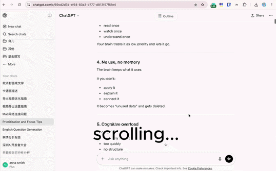

[English](./README.md) | [简体中文](./README.zh-CN.md)

# ChatGPT Outline（Demo）

长对话滚动查找，非常痛苦。

这个插件会把 ChatGPT 对话变成一个清晰、可点击的目录，让你可以直接跳转，而不是一直滚动。

---

## 功能

- 从 ChatGPT 对话生成结构化目录  
- 点击目录快速跳转到对应位置  
- 对话变化时自动刷新  
- 支持左右侧边栏切换  

---

## 为什么做这个

当对话变长之后，滚动本身就成了主要成本。

这个工具一开始只是我自己日常使用时做的一个小优化。

---

## 关于这个版本

这是一个轻量、可查看源码的版本，只保留最核心的导航功能。

整体设计是：简单、本地运行、易于理解。

当前 Demo 版仅前 15 条目录支持点击跳转。

---

## 完整版本

后来我做了一个更完整的版本，用在自己的日常工作流中，包括：

- 重点标记  
- 对话导出  
- 更流畅的长对话导航  

完整版可以在这里体验：

👉 [Chrome 商店安装](https://chromewebstore.google.com/detail/chatgpt-outline-%E2%80%93-navigat/opbngifmlnoahbhjhgmngkggedlofddj)

👉 [官网介绍](https://wisteriasoftware.uk/outline-pro)

---

## 隐私说明

- 所有聊天内容都只在浏览器本地处理  
- 当前版本不会上传任何对话数据  
- 不包含统计或跟踪  
- 仅使用少量本地存储（例如侧边栏位置）

---

## 本地开发

可以将本目录作为未打包扩展加载到 Chrome / Chromium 中。

所有功能均在本地运行。

---

## 许可证

本版本基于 LICENSE 中的自定义许可证发布。

不属于 MIT / Apache-2.0 等可自由商用的开源协议。

---

## 品牌与商业权利

使用本代码并不意味着你获得以下权利：

- 产品名称  
- 品牌与视觉设计  
- 官方域名与商店页面  
- 商业版功能与付费体系  

详见 NOTICE 文件。
